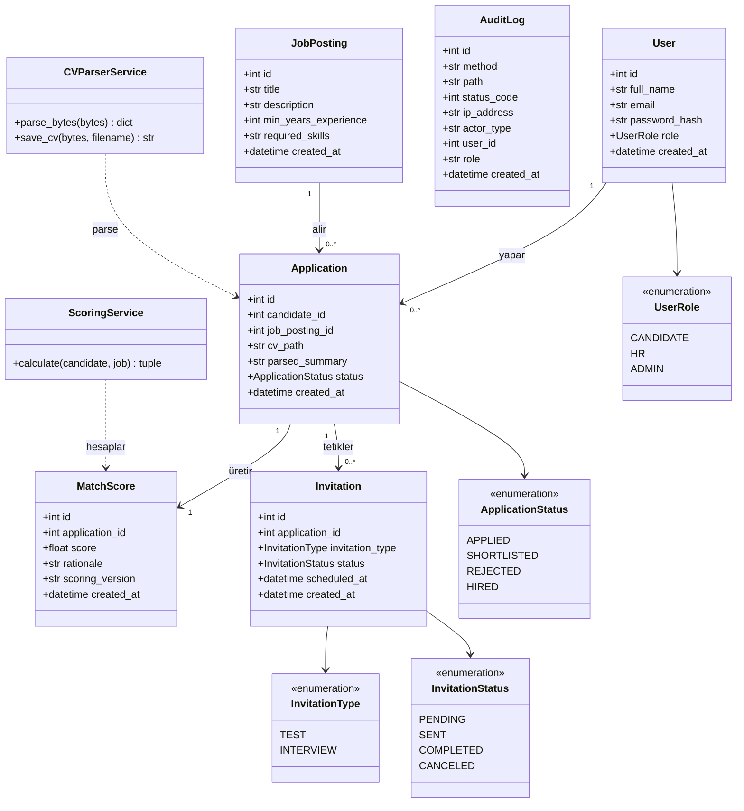
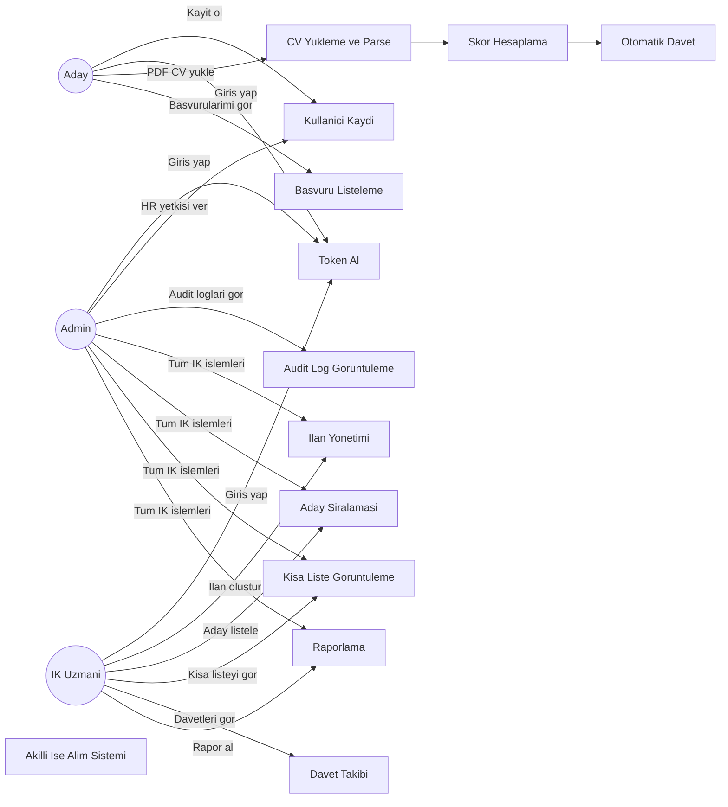
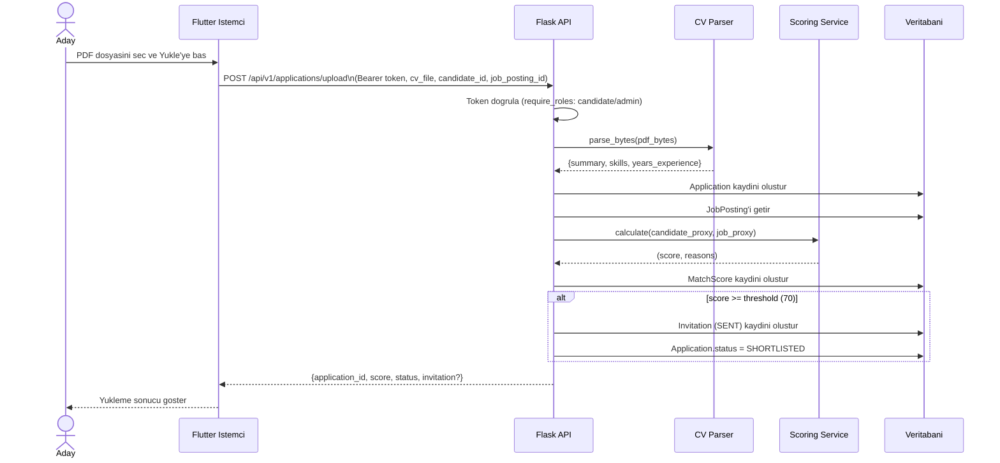
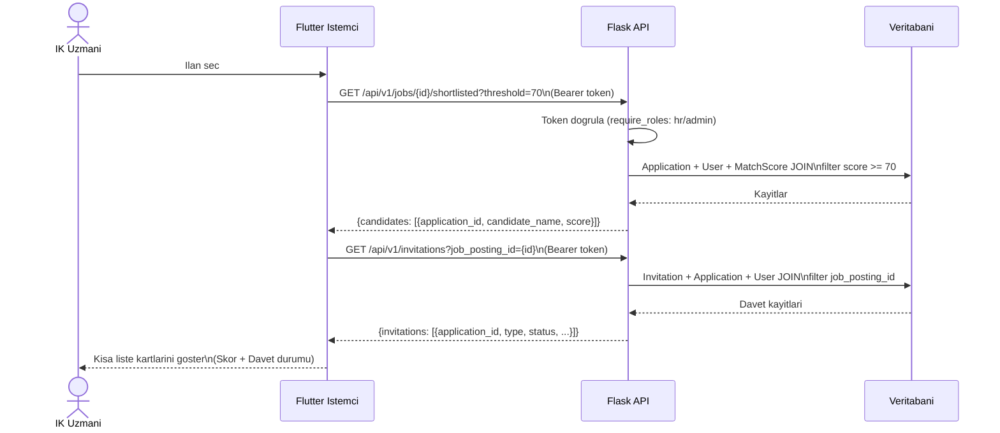

# UML Diyagramlari

Bu dosya Mermaid sözdizimi ile hazırlanmış Class, Use Case ve Sequence diyagramlarını içerir.

---

## 1. Sinif Diyagrami (Class Diagram)

---

## 2. Kullanim Durumu Diyagrami (Use Case Diagram)

---

## 3. Sıra Diyagrami — CV Yukleme ve Otomatik Davet Akisi (Sequence Diagram)

---

## 4. Sıra Diyagrami — HR Kisa Liste Goruntuleme (Sequence Diagram)

